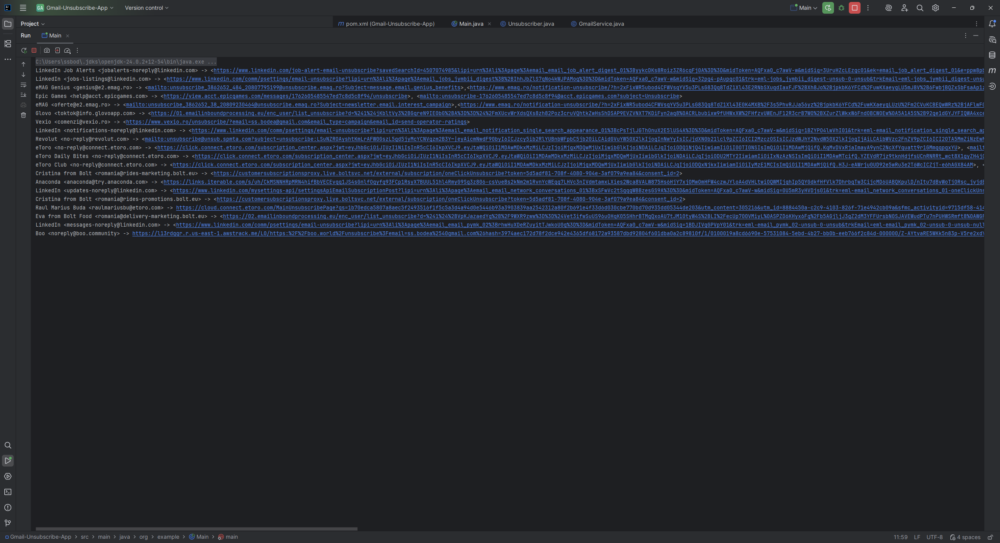

# Gmail Unsubscriber

**Gmail Unsubscriber** is a Java console application that scans your Gmail inbox for subscription emails, identifies unsubscribe links, and prints them along with the sender in real time. It helps clean your inbox efficiently by showing sender → unsubscribe link mappings and tracking progress.

---

## Features

- Scan all emails in Gmail (newest → oldest).
- Detect unsubscribe links using:
  - **List-Unsubscribe header** (fast method).
  - **HTML body parsing** with multiple unsubscribe-related keywords.
- Console output with:
  - Emails scanned / total count.
  - Unique senders count.
  - Sender → unsubscribe link mapping printed as found.
- Stores email → unsubscribe link mapping in memory.
- Supports Gmail API OAuth 2.0 authentication.

---

## Setup Instructions

### 1. Google Cloud Console

1. Go to [Google Cloud Console](https://console.cloud.google.com/).
2. Create a new project (or select an existing one).
3. Enable the **Gmail API** for your project.
4. Navigate to **APIs & Services → Credentials**:
   - Create **OAuth 2.0 Client ID** (Desktop app).
   - Download the JSON file and save it as `credentials.json` in the project root.
5. Add your Gmail account as a **test user** if the app is not verified.
6. Change the path to credentials.json in GmailService class to point to your path.

### 2. Maven / IntelliJ Setup

1. Open the project in **IntelliJ IDEA**.
2. Ensure `pom.xml` includes dependencies:
   - Google API Client
   - Gmail API
   - OAuth Client
   - JSoup
3. Build the project to download dependencies.
4. Add `.gitignore` to ignore sensitive files:

### 3. Running the Application

1. Run `Main.java` from the console.  
2. Authorize Gmail access in the browser when prompted.  
3. The console will display:
   - Emails scanned / total
   - Unique senders count
   - Sender → unsubscribe link as found  
4. After completion, review all unsubscribe links to clean your inbox.

## Skills Learned

- Java programming (console applications, multithreading)
- Gmail API integration and OAuth 2.0
- Email parsing and string pattern matching
- HTML parsing using **JSoup**
- Git and GitHub project management (handling secrets)
- Maven project structure and dependency management
- Real-time progress updates in console applications

---

## Usage Notes

- **Do not commit `credentials.json` or tokens** to GitHub.  
- Push protection may block commits with secrets; always use `.gitignore`.  
- Regenerate OAuth credentials if they are ever exposed.  
- Scans emails **newest → oldest** to prioritize recent subscriptions.
